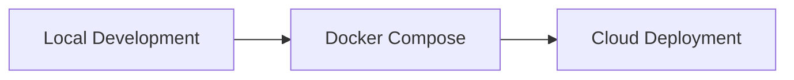

# 🗺️ G.I.T - Geospatial Issue Tracker

> 뉴스·이슈 데이터를 수집하고 AI로 분석한 뒤, 지역 단위로 분류하여 지도 위에 시각화하는 이슈 트래킹 서비스

---

## 서비스 개요

**G.I.T(Geospatial Issue Tracker)** 는 서울 지역의 뉴스·공공 이슈를 수집하고, AI 분석을 통해 요약·키워드·지역 정보를 추출한 뒤 지도 기반으로 시각화하는 서비스입니다.

지역 이슈를 **공간 정보(Geospatial Data)** 와 연결하여 지도 기반으로 확인할 수 있게 제공합니다.

### 핵심 기능

| 기능 | 설명 |
|---|---|
| 📰 이슈 수집 | 외부 뉴스/이슈 데이터를 주기적으로 수집 |
| 🧹 데이터 정규화 | Source별 Crawling 데이터 도메인 포맷으로 변환 |
| 🧠 AI 분석 | 기사 요약, 키워드 추출, 지역명 추출 |
| 📍 지역 매핑 | 추출된 지역 정보를 서울 행정구역 기준으로 매핑 하여 지도 마킹 |
| 🔎 이슈 조회 | 기사 목록, 상세 내용, 분석 결과 조회 |
| 🔄 서비스 통신 | Redis Streams 기반 Event Broker 방식 서비스간 통신 구현 |

---

## 시스템 구조

각 서비스는 독립적인 책임을 가지고 메인 백엔드를 중심으로 Redis Streams 기반 이벤트 통신을 사용합니다.


## 서비스별 역할

| Service | Tech | Responsibility |
|---|---|---|
| **Backend** | ASP.NET Core | Application Service + Orchestrator + Data Authority |
| **Backend Worker** | ASP.NET Core BackgroundService | Redis Stream Consumer, Crawler/Analyzer 데이터 Validate, PostgreSQL DB 저장 |
| **Crawler** | Python | 외부 뉴스/이슈 수집, 1차 정규화, RawContents Event 발행 |
| **Analyzer** | Python | AI 요약, 키워드 추출, 지역명 추출, 분석 Event 발행 |
| **Frontend** | React, Leaflet | 지도 기반 이슈 시각화, 기사 목록/상세 UI |
| **PostgreSQL** | PostgreSQL | Database |
| **Redis Streams** | Redis | 서비스 간 비동기 이벤트 파이프라인 |

---

## 데이터 흐름

```text
[1] Crawler
    └─ 뉴스/이슈 데이터 수집

[2] Redis Streams
    └─ raw content event 발행

[3] AI Analyzer
    └─ 요약 / 키워드 / 지역명 분석

[4] Redis Streams
    └─ 크롤링, AI 분석 결과 Event 발행

[5] Backend Worker
    └─ 이벤트 소비, Data Validation, DB 저장

[6] Backend API
    └─ 기사/분석 결과 조회 API 제공

[7] Frontend
    └─ 지도 기반 이슈 시각화
```

---

## DB 설계, ERD

DB 설계는 EF Core CodeFirst 방식으로 진행했습니다.
Crawler와 Analyzer는 DB에 직접 접근하지 않고, Backend Worker가 이벤트를 소비하여 최종 데이터를 저장합니다.


---

## 배포 전략

배포는 로컬 실행 환경에서 시작해 Docker Compose 기반 통합 환경을 구성하고, 이후 클라우드 환경으로 점진적으로 확장합니다.



| 단계 | 목표 | 설명 |
|---|---|---|
| 1 | Local Development | 개별 서비스 로컬 실행 및 기능 검증 |
| 2 | Docker Compose | Backend, Worker, Crawler, Analyzer, PostgreSQL, Redis 통합 실행 |
| 3 | Cloud Deployment | API/Worker/Frontend/DB/Redis 클라우드 배포 |

---

## 🛣️ Roadmap

세부 작업은 Issue 또는 별도 문서에서 관리하고, README에서는 큰 목표 단위만 추적합니다.

| Phase | 목표 | Status |
|---|---|---|
| 1️⃣ MVP | 서울 지역 대상, 1개 카테고리 크롤링 기반 End-to-End 동작 구현 | in-progress |
| 2️⃣ Refactoring | Clean Architecture 적용 Backend 구조 개선 | - |
| 3️⃣ Expansion | 서울 지역 N개 카테고리 확장 및 지역 기준 분석 고도화 | - |

---

## 🧪 Tech Stack

| Area | Stack |
|---|---|
| Backend | C#, ASP.NET Core, EF Core, BackgroundService |
| Frontend | React, TypeScript, Leaflet |
| Crawler | Python, Web Crawling |
| Analyzer | Python, LLM Agent 분석기 Pipeline |
| Database | PostgreSQL |
| Event Broker | Redis Streams |
| Infra | Docker, Docker Compose, Nginx, Oracle Cloud(예정) |
| DevOps | GitHub Actions |

---

## 📝 개발 의사결정 기록

이 문단은 G.I.T의 기획, 시스템 아키텍처, 서비스 간 통신, 백엔드/프론트엔드 설계, 배포 환경 구성 과정에서 발생한 주요 의사결정을 기록한 섹션입니다.

<details>
<summary><strong>기획</strong></summary>

### [프로젝트 개요]

지역 뉴스나 사사로운 지역 이슈 들을 지도 기반으로 쉽게 확인할 수 있는 서비스가 존재한다면
어떨까 라는 생각으로 개발하게 되었습니다.

또한 개발 학습 차원에서 기존의 GIS 기반 웹서비스 개발 경험을 바탕으로 **웹 크롤링 + AI Pipeline + 웹 서비스 아키텍쳐 설계**를 경험하고
AI Agent를 활용한 **AI-Assisted 개발 Workflow 학습**을 목적으로 진행하였습니다.

### [1차/2차 개발계획]

지역 기반 이슈 소스 탐색 + 웹 크롤링 후 포맷팅 -> AI 분석을 통한 키워드 추출 이라는 주요 기능 구현 및 실증을 우선목표로 1차 개발을 진행하고

2차 개발에서 Architecture 개선 등 고도화 하는 전략으로 방향을 정했습니다.


2차 아키텍쳐 개선 이후 Souce 카테고리를 추가하고 서비스 지역을 확대하는것이 목표입니다.

</details>

<details>
<summary><strong>서비스간 통신</strong></summary>

### [REST API 기반 통신 vs Event Broker]

#### 의사결정 요약

Crawler, Analyzer, Backend 간 통신은 REST API 기반이 아닌 Redis Streams를 Event Broker로 하는 Event-Driven 방식을 통해 통신하도록 결정했습니다.
각 서비스는 서로의 API Enpoint가 아니라 Stream을 통해 Message를 Publish/Consume 하는 구조로 설계 했습니다.

#### 근거/Trade-off

G.I.T의 핵심 DataFlow는 Crawler -> AI 분석

<!-- 직접 API 호출 구조는 서비스 위치, 호출 순서, 장애 전파에 대한 결합이 커진다.
Redis Streams를 사용하면 처리 속도 차이를 흡수하고, Consumer Group과 Pending 처리를 통해 재처리 흐름을 설계할 수 있다. -->

메시지 스키마, ACK, Pending 재처리, 중복 처리 등 추가 설계가 필요하다.
대신 수집 → 분석 → 저장으로 이어지는 비동기 파이프라인 구조를 더 명확하게 분리할 수 있다.

---

### [Redis Streams를 Event Broker로 사용]

#### 의사결정 요약

Redis는 캐시나 메인 저장소가 아니라 서비스 간 이벤트 전달을 담당하는 Event Broker로 사용한다.
영속 데이터의 기준은 PostgreSQL에 둔다.

#### 선택 이유

Redis Streams는 Consumer Group, ACK, Pending 메시지 확인을 지원하면서 Kafka보다 가볍게 도입할 수 있다.
1차 규모에서는 대규모 스트리밍 플랫폼보다 Docker Compose 기반으로 빠르게 재현 가능한 구성이 더 적합하다.

#### Trade-off

Kafka 대비 장기 보관, 대규모 파티셔닝, 운영 안정성 측면에서는 한계가 있다.
대신 1차 목표에서는 구현 복잡도를 낮추고 이벤트 기반 처리 경험을 확보하는 데 집중한다.

---

### [서비스별 DB 직접 접근 제한]

#### 의사결정 요약

Crawler와 Analyzer는 PostgreSQL에 직접 접근하지 않는다.
최종 저장, 중복 확인, 데이터 정합성 관리는 Backend Worker가 담당한다.

#### 선택 이유

각 서비스가 DB를 직접 참조하면 스키마 변경 영향이 확산되고, 검증/중복 처리 책임이 분산된다.
Backend를 DB 접근의 단일 진입점으로 두면 PostgreSQL Source of Truth와 EF Core CodeFirst 기준을 유지하기 쉽다.

#### Trade-off

Backend Worker의 책임이 커지고, Worker 장애 시 적재가 지연될 수 있다.
대신 데이터 정합성, 중복 방지, 스키마 관리 책임을 한 곳에 집중할 수 있다.

---

### [At-Least-Once 처리와 중복 저장 방지]

#### 의사결정 요약

Redis Streams Consumer는 At-Least-Once 처리를 전제로 설계한다.
중복 저장 방지는 Backend 저장 로직과 PostgreSQL Unique Constraint에서 처리한다.

#### 선택 이유

Consumer 장애, ACK 실패, 네트워크 오류가 발생하면 동일 메시지가 재처리될 수 있다.
따라서 메시지가 정확히 한 번만 처리된다고 가정하지 않고, 저장 로직을 Idempotent하게 구성하는 편이 안전하다.

#### Trade-off

중복 확인, Unique Constraint 충돌 처리, 실패 로그 관리가 추가로 필요하다.
대신 이벤트 기반 시스템에서 재처리 안정성과 최종 데이터 정합성을 확보할 수 있다.

</details>

---

<details>
<summary><strong>백엔드</strong></summary>

<br/>

### [Classic Layered Architecture vs Clean Architecture]

#### 의사결정 요약

1차 마일스톤에서는 강한 Clean Architecture보다 Classic Layered Architecture 기반으로 백엔드를 구현한다.
Clean Architecture 성격의 분리는 2차 구조 개선 단계에서 점진적으로 적용한다.

#### 선택 이유

1차에서는 Redis Consumer, EF Core 저장 흐름, API 응답, Docker 실행, React 연동을 먼저 검증해야 한다.
초기부터 프로젝트 단위로 레이어를 강하게 나누면 실제 기능보다 구조 설계 비용이 커질 수 있다.

#### Trade-off

Service Layer가 비대해지거나 일부 책임이 섞일 수 있다.
대신 초기 복잡도를 낮추고, 실제 복잡도가 드러난 지점을 기준으로 구조를 개선할 수 있다.

---

### [EF Entity <-> Domain Class 분리]

#### 의사결정 요약

1차 구현에서는 EF Entity와 Domain Class를 강하게 분리하지 않는다.
복잡한 도메인 규칙이 생기는 시점에 분리 여부를 재검토한다.

#### 선택 이유

현재 핵심은 복잡한 도메인 행위보다 수집된 데이터를 분석 결과와 함께 안정적으로 저장하고 조회하는 것이다.
초기부터 Entity/Domain/DTO 매핑을 분리하면 구조는 정교해지지만 실제 기능 대비 코드 비용이 커진다.

#### Trade-off

도메인 모델이 EF Core 구조에 영향을 받을 수 있다.
대신 과한 추상화를 피하고, 실제 비즈니스 규칙이 복잡해지는 영역만 나중에 분리할 수 있다.

---

### [Backend API + Worker 통합 실행]

#### 의사결정 요약

1차에서는 Backend API와 Redis Consumer Worker를 같은 ASP.NET Core Host 안에서 실행한다.
Worker는 BackgroundService로 구성한다.

#### 선택 이유

API와 Worker는 EF Core DbContext, Logging, Configuration, DI, 공통 Application Service를 공유한다.
초기부터 별도 컨테이너와 프로젝트로 분리하면 공통 코드와 배포 구성이 불필요하게 복잡해진다.

#### Trade-off

Worker 장애나 리소스 사용량이 API에 영향을 줄 수 있다.
대신 1차에서는 운영 단순성을 확보하고, 처리량 증가 시 API/Worker 분리를 2차 구조로 전환할 수 있다.

---

### [PostgreSQL을 Source of Truth로 사용]

#### 의사결정 요약

G.I.T의 최종 데이터 기준은 PostgreSQL로 둔다.
Redis, Crawler, Analyzer는 중간 처리 계층이며 영속 데이터의 정합성은 PostgreSQL이 담당한다.

#### 선택 이유

뉴스 수집 시스템은 중복 기사, 지연 분석, 재처리 가능성이 존재한다.
PostgreSQL은 관계형 모델, Unique Constraint, Index, jsonb를 함께 활용할 수 있어 정합성과 유연성을 모두 확보하기 좋다.

#### Trade-off

DB 스키마와 Migration 관리가 중요해지고, 모든 저장 흐름이 Backend를 거쳐야 한다.
대신 데이터 기준점을 명확히 두어 중복 방지와 추적 가능성을 확보할 수 있다.

---

### [EF Core CodeFirst 기반 스키마 관리]

#### 의사결정 요약

DB 스키마는 수동 SQL 우선 방식이 아니라 EF Core CodeFirst와 Migration을 기준으로 관리한다.
Backend 코드가 DB 구조 변경의 기준이 된다.

#### 선택 이유

DB 접근 책임을 Backend에 집중했기 때문에 Entity 변경과 Migration 이력을 함께 관리하는 방식이 일관적이다.
개발 환경 재구성, 스키마 변경 추적, 코드와 DB 구조 동기화 측면에서도 유리하다.

#### Trade-off

복잡한 DB 제약이나 세밀한 튜닝은 수동 SQL보다 표현이 제한될 수 있다.
대신 애플리케이션 코드와 DB 스키마의 기준을 단일화할 수 있다.

</details>

---

<details>
<summary><strong>프론트</strong></summary>

<br/>

### [Leaflet vs OpenLayers]

#### 의사결정 요약

프론트엔드 지도 렌더링 라이브러리는 OpenLayers가 아니라 Leaflet을 선택한다.
1차 목표에서는 고급 GIS 기능보다 지역 이슈 시각화가 핵심이다.

#### 선택 이유

현재 필요한 기능은 서울시 구 단위 Polygon 표시, 지역별 이슈 수 표현, 지도 클릭 기반 기사 목록 갱신이다.
이 범위에서는 OpenLayers보다 Leaflet이 단순하고 구현 속도가 빠르다.

#### Trade-off

복잡한 좌표계 변환, WMS/WFS 고급 연동, 대용량 벡터 타일 처리에는 OpenLayers가 더 적합할 수 있다.
대신 1차 목표에서는 구현 단순성과 React 연동 편의성을 우선한다.

---

### [GeoJSON 기반 행정구역 시각화]

#### 의사결정 요약

서울시 행정구역 경계 데이터는 GeoJSON 형태로 관리하고 Leaflet에서 Polygon으로 렌더링한다.
지역별 이슈 데이터와 지도 영역을 연결하는 기준으로 사용한다.

#### 선택 이유

GeoJSON은 Leaflet과 연동이 쉽고 행정구역 Polygon 표현에 적합하다.
구 단위 이슈 수 표시, 지도 클릭 기반 필터링, 기사 목록 연동을 단순한 구조로 구현할 수 있다.

#### Trade-off

행정구역 단위가 세밀해질수록 파일 크기와 렌더링 비용이 증가한다.
대신 1차 범위가 서울시 구 단위이므로 초기 성능 부담은 관리 가능한 수준으로 본다.

---

### [React 기반 SPA 구성]

#### 의사결정 요약

프론트엔드는 React 기반 SPA로 구성한다.
지도 선택 상태와 기사 목록 상태를 API 응답 기준으로 동기화한다.

#### 선택 이유

G.I.T 화면은 지도 클릭, 지역 선택, 기사 목록 갱신이 반복되는 상태 기반 UI다.
React는 선택 지역 상태와 API 호출 결과를 기반으로 화면을 갱신하기에 적합하다.

#### Trade-off

초기 상태 관리 구조와 API 연동 설계가 필요하다.
대신 1차 목표는 SEO보다 데이터 탐색 UI 제공에 가깝기 때문에 SPA 구성이 적합하다.

</details>

---

<details>
<summary><strong>배포환경</strong></summary>

<br/>

### [Docker Compose 기반 통합 실행 환경]

#### 의사결정 요약

Backend, Python 서비스, PostgreSQL, Redis, Frontend를 Docker Compose 기반으로 통합 실행한다.
멀티 서비스 실행 환경을 하나의 구성 파일로 재현 가능하게 만든다.

#### 선택 이유

G.I.T는 단일 애플리케이션이 아니라 여러 서비스가 함께 동작하는 구조다.
Docker Compose를 사용하면 로컬 실행 환경을 표준화하고 서비스 간 네트워크, 환경변수, 의존 서비스를 명확히 관리할 수 있다.

#### Trade-off

컨테이너 네트워크, 볼륨, 환경변수, Windows/WSL 이슈를 관리해야 한다.
대신 멀티 서비스 구조를 재현하고 포트폴리오 검토자가 실행 흐름을 이해하기 쉬워진다.

---

### [Managed Service 의존 최소화]

#### 의사결정 요약

1차 단계에서는 AWS RDS, Managed Redis, Cloud Load Balancer 같은 Managed Service 의존을 최소화한다.
Docker Compose 기반 자체 실행 환경을 우선 구성한다.

#### 선택 이유

초기 목표는 클라우드 리소스 사용 자체보다 서비스 간 연결 구조와 데이터 흐름을 직접 설계하고 검증하는 것이다.
Redis, PostgreSQL, 네트워크, 실행 순서, 환경변수 주입을 직접 다루는 편이 시스템 이해에 더 유리하다.

#### Trade-off

운영 안정성, 백업, 장애 복구, 모니터링은 직접 관리해야 한다.
대신 1차에서는 운영 자동화보다 재현 가능한 실행 환경과 구조 이해를 우선한다.

---

### [Monorepo 기반 프로젝트 관리]

#### 의사결정 요약

Backend, Frontend, Crawler, Analyzer, Infra 설정을 하나의 Repository에서 관리하는 Monorepo 구조를 선택한다.
서비스는 독립 실행되지만 하나의 데이터 파이프라인으로 관리한다.

#### 선택 이유

초기에는 여러 Repository로 나누는 것보다 전체 시스템 구조를 한곳에서 보여주는 편이 명확하다.
README, Docker Compose, 서비스 경로, 공통 문서를 함께 관리할 수 있어 포트폴리오 검토 진입 장벽을 낮출 수 있다.

#### Trade-off

프로젝트가 커지면 Repository 규모, 서비스별 배포 주기, 권한 관리가 복잡해질 수 있다.
대신 현재 단계에서는 전체 구조를 한눈에 설명하는 것이 더 중요하다.

</details>

