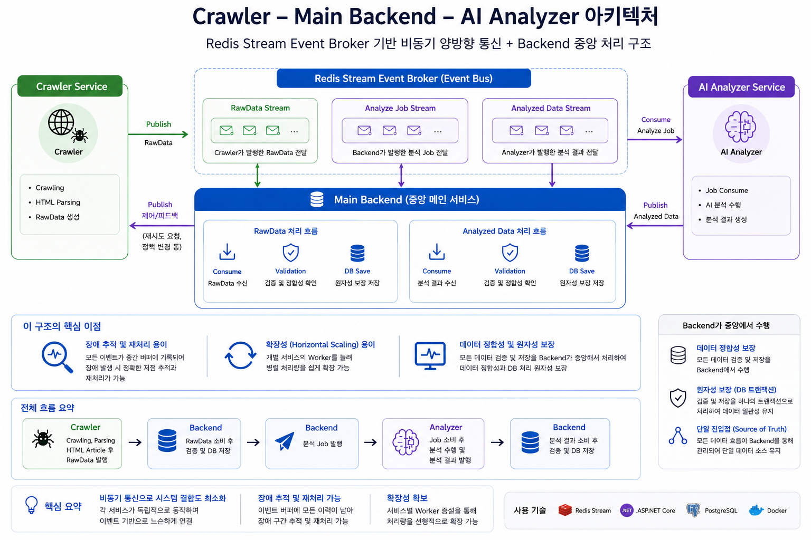
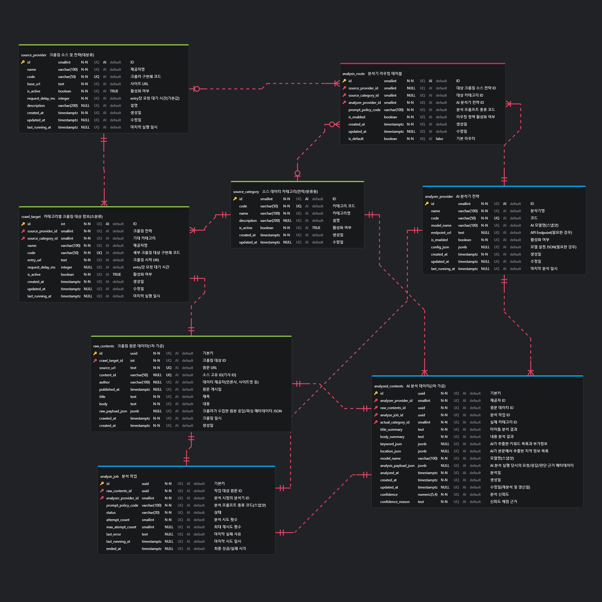
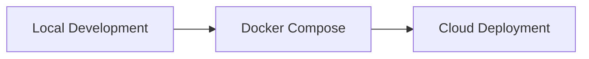

# 🗺️ G.I.T - Geospatial Issue Tracker

## 서비스 개요

**G.I.T(Geospatial Issue Tracker)** 는 지역기반으로 뉴스·공공 이슈를 수집하고, AI 분석을 통해 기사 요약 및 지역, 키워드를 추출한 뒤 
실제 행정구역과 매핑하여 지도 기반으로 지역 이슈를 확인하는 기능을 제공하는 서비스 입니다.

### 핵심 기능

| 기능 | 설명 |
|---|---|
| 📰 이슈 수집 | 외부 뉴스/이슈 데이터를 주기적으로 수집 |
| 🧹 데이터 정규화 | Source별 Crawling 데이터 도메인 포맷으로 변환 |
| 🧠 AI 분석 | LLM AI 분석을 통해 기사 요약, 키워드 추출, 지역명 추출 |
| 📍 지역 매핑 | 추출된 지역 정보를 서울 행정구역 기준으로 매핑 하여 지도 마킹 |
| 🔎 이슈 조회 | 기사 목록, 상세 내용, 분석 결과 조회 |

---

## 시스템 구조

각 서비스는 독립적인 책임을 가지고 메인 백엔드를 중심으로 Redis Streams 기반 이벤트 통신을 사용합니다.  
Crawler와 Analyzer는 데이터 수집·분석 작업에 집중하고, Backend는 이벤트 소비, 데이터 검증, DB 저장을 담당하여  
데이터 정합성과 처리 흐름을 중앙에서 관리합니다.

## Tech Stack, 서비스별 책임 구조

| Service | Tech | Responsibility |
|---|---|---|
| **Backend** | ASP.NET Core | Application Service + Orchestrator + Data Authority |
| **Backend Worker** | ASP.NET Core BackgroundService | Redis Stream Consumer, Crawler/Analyzer 데이터 Validate, PostgreSQL DB 저장 |
| **Crawler** | Python | 외부 뉴스/이슈 수집, 1차 정규화, RawContents Event 발행 |
| **Analyzer** | Python | AI 요약, 키워드 추출, 지역명 추출, 분석 Event 발행 |
| **Frontend** | React, Leaflet | 지도 기반 이슈 시각화, 기사 목록/상세 UI |
| **PostgreSQL** | PostgreSQL | Database |
| **Redis Streams** | Redis | 서비스 간 비동기 이벤트 파이프라인 |

---

## DB 설계, ERD

PostgreSQL을 기반으로 하며, Entity Framework Core Code First 방식을 DB 설계의 Source of Truth로 사용합니다.  
주요 제약조건과 관계는 EF Fluent API 및 Migration을 통해 관리하며, 초기 테이블 구조는 ERD로 설계했습니다.

---

## 배포 전략

배포는 로컬 실행 환경에서 시작해 Docker Compose 기반 통합 환경을 구성하고, 이후 클라우드 환경으로 점진적으로 확장합니다.

| 단계 | 목표 | 설명 |
|---|---|---|
| 1 | Local Development | 개별 서비스 로컬 실행 및 기능 검증 |
| 2 | Docker Compose | WSL 개발서버: Backend, Worker, Crawler, Analyzer, PostgreSQL, Redis 통합 실행 |
| 3 | Cloud Deployment | API/Worker/Frontend/DB/Redis 클라우드 배포 |

---

## 🛣️ Roadmap

현재 개발 진행상황과 이후 고도화 계획을 MVP → Refactoring → Expansion 단계로 구분하여 정리합니다.

| Phase       | Task                                                         | Status |
| ----------- | ------------------------------------------------------------ | ------ |
| MVP         | 요구사항 정의, 아키텍처 설계, DB 모델링 및 AI Agent 기반 개발 환경 구축              | ✅      |
| MVP         | 비동기 이벤트 기반 데이터 수집·분석 파이프라인 구현 (Crawler → Backend → Analyzer) | ✅     |
| MVP         | 장애 복구, 재처리 로직 검증 및 Docker Compose 기반 운영 환경 구성                | 🚧      |
| MVP         | Frontend 연동 및 Full-Cycle 서비스 검증                              | ⏳      |
| Refactoring | 아키텍처 개선, 테스트 코드 작성 및 운영성 강화                                  | ⏳      |
| Expansion   | 데이터 소스 및 분석 기능 확장                                            | ⏳      |
