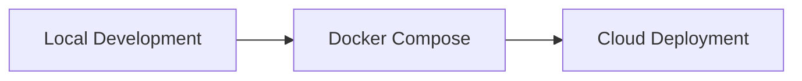

# 🗺️ G.I.T - Geospatial Issue Tracker

> 뉴스·이슈 데이터를 수집하고 AI로 분석한 뒤, 지역 단위로 분류하여 지도 위에 시각화하는 이슈 트래킹 서비스

---

## 서비스 개요

**G.I.T(Geospatial Issue Tracker)** 는 서울 지역의 뉴스·공공 이슈를 수집하고, AI 분석을 통해 요약·키워드·지역 정보를 추출한 뒤 지도 기반으로 시각화하는 서비스입니다.

지역 이슈를 **공간 정보(Geospatial Data)** 와 연결하여 지도 기반으로 확인할 수 있게 제공합니다.

### 핵심 기능

| 기능 | 설명 |
|---|---|
| 📰 이슈 수집 | 외부 뉴스/이슈 데이터를 주기적으로 수집 |
| 🧹 데이터 정규화 | Source별 원본 데이터를 내부 표준 포맷으로 변환 |
| 🧠 AI 분석 | 기사 요약, 키워드 추출, 지역명 추출 |
| 📍 지역 매핑 | 추출된 지역 정보를 서울 행정구역 기준으로 매핑 |
| 🗺️ 지도 시각화 | 지역별 이슈를 지도 위 Marker/Polygon 형태로 표시 |
| 🔎 이슈 조회 | 기사 목록, 상세 내용, 분석 결과 조회 |
| 💬 댓글 기능 | 사용자 기반 이슈 토론 기능 |
| 🔄 비동기 처리 | Redis Streams 기반 서비스 간 이벤트 처리 |

---

## 시스템 구조

각 서비스는 독립적인 책임을 가지고 메인 백엔드를 중심으로 Redis Streams 기반 이벤트 통신을 사용합니다.

> 서비스 아키텍쳐 이미지 추가

## 서비스별 역할

| Service | Tech | Responsibility |
|---|---|---|
| **Backend** | ASP.NET Core | Application Service + Orchestrator + Data Authority |
| **Backend Worker** | ASP.NET Core BackgroundService | Redis Stream Consumer, Crawler/Analyzer 데이터 Validate, PostgreSQL DB 저장 |
| **Crawler** | Python | 외부 뉴스/이슈 수집, 1차 정규화, RawContents Event 발행 |
| **Analyzer** | Python | AI 요약, 키워드 추출, 지역명 추출, 분석 Event 발행 |
| **Frontend** | React, Leaflet | 지도 기반 이슈 시각화, 기사 목록/상세 UI |
| **PostgreSQL** | PostgreSQL | Database |
| **Redis Streams** | Redis | 서비스 간 비동기 이벤트 파이프라인 |

---

## 데이터 흐름

```text
[1] Crawler
    └─ 뉴스/이슈 데이터 수집

[2] Redis Streams
    └─ raw content event 발행

[3] AI Analyzer
    └─ 요약 / 키워드 / 지역명 분석

[4] Redis Streams
    └─ 크롤링, AI 분석 결과 Event 발행

[5] Backend Worker
    └─ 이벤트 소비, Data Validation, DB 저장

[6] Backend API
    └─ 기사/분석 결과 조회 API 제공

[7] Frontend
    └─ 지도 기반 이슈 시각화
```

---

## DB 설계, ERD

DB 설계는 EF Core CodeFirst 방식으로 진행했습니다.
Crawler와 Analyzer는 DB에 직접 접근하지 않고, Backend Worker가 이벤트를 소비하여 최종 데이터를 저장합니다.

> ERD 이미지 추가 예정

---

## 배포 전략

배포는 로컬 실행 환경에서 시작해 Docker Compose 기반 통합 환경을 구성하고, 이후 클라우드 환경으로 점진적으로 확장합니다.



| 단계 | 목표 | 설명 |
|---|---|---|
| 1 | Local Development | 개별 서비스 로컬 실행 및 기능 검증 |
| 2 | Docker Compose | Backend, Worker, Crawler, Analyzer, PostgreSQL, Redis 통합 실행 |
| 3 | Cloud Deployment | API/Worker/Frontend/DB/Redis 클라우드 배포 |

---

## 🛣️ Roadmap

세부 작업은 Issue 또는 별도 문서에서 관리하고, README에서는 큰 목표 단위만 추적합니다.

| Phase | 목표 | Status |
|---|---|---|
| 📚 Study | 웹 크롤링, React, Leaflet, Redis Streams 등 초기 학습 | ⬜ |
| 1️⃣ MVP | 서울 지역 대상, 1개 카테고리 크롤링 기반 End-to-End 동작 구현 | ⬜ |
| 2️⃣ Refactoring | Clean Architecture 적용 범위 재검토 및 Backend 구조 개선 | ⬜ |
| 3️⃣ Expansion | 서울 지역 N개 카테고리 확장 및 지역 기준 분석 고도화 | ⬜ |

---

## 🧪 Tech Stack

| Area | Stack |
|---|---|
| Backend | ASP.NET Core, C#, EF Core, BackgroundService, Serilog |
| Frontend | React, TypeScript, Leaflet |
| Crawler | Python, Web Crawling |
| Analyzer | Python, Agent Pipeline 연결, AI 분석, 키워드 추출, 지역 추출 등 |
| Database | PostgreSQL |
| Messaging | Redis Streams |
| Infra | Docker, Docker Compose, Nginx |
| DevOps | GitHub Actions |

---

## 📝 개발 History

설계 의사결정과 TroubleShooting 기록은 README에서 기본적으로 접어두고, 상세 내용은 `Docs/` 하위 문서로 분리합니다.
